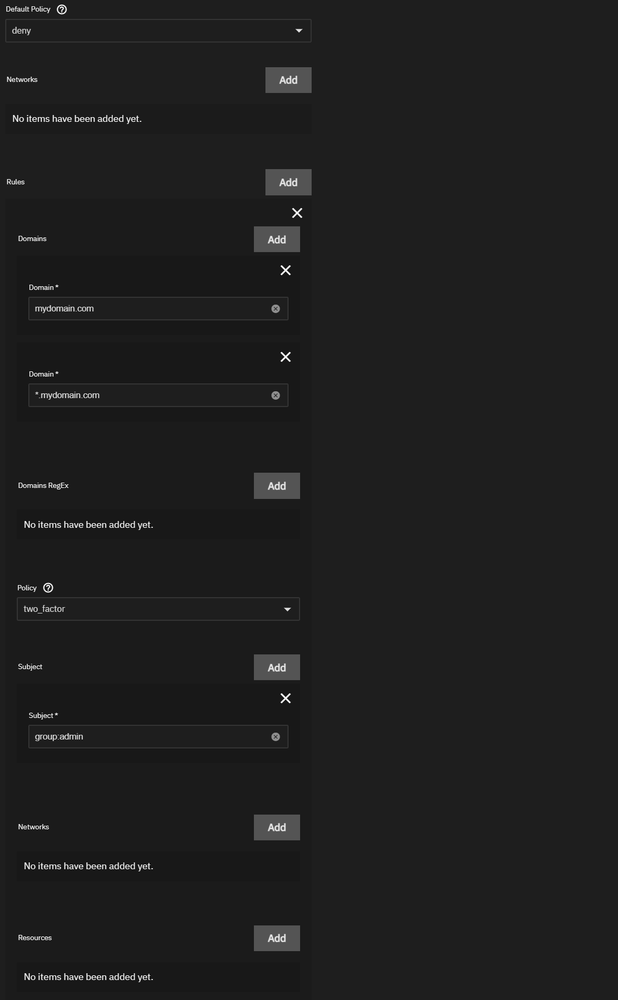

This quick guide should take you through the steps necessary to setup `Authelia` as your `forwardAuth` for `Traefik`. We'll be using `LLDAP` as the backend for `Authelia` since it's lightweight and simple enough for most users. A more complete video is available on our YouTube Channel

## Prerequisites

- Traefik installed (enable the `enterprise train`)
- Clusterissuer for certificates
- CloudnativePG operator (enable the `operators train`)

## Setup LLDAP

:::warning

LLDAP is a `Stable` train chart and therefore isn't supported at the same level as the charts in the `Enterprise` train (Authelia and Traefik).

:::

- Follow the steps included in the [Installation Notes](https://truecharts.org/charts/stable/lldap/installation-notes) for [LLDAP](https://truecharts.org/charts/stable/lldap/). Pretty straightforward. Change `dc=example,dc=com` to your domain, i.e. `dc=MYDOMAIN,dc=net` and then change your password. Also make sure you have the `Operators` train enabled and `CloudnativePG` operator installed, since you'll need it for `LLDAP` and `Authelia`

- I've set the services to `ClusterIP` since I'll be using ingress

- Once in `LLDAP`, create a user inside the `lldap_password_manager` group and change your default `admin` password. That `lldap_password_manager` user will be used to bind to `Authelia`. I've created a user called `Steven`

## Setup Authelia

- The setup for Authelia is very specific, and the logs won't tell you where you've messed up, but there's precise steps used to integrate `LLDAP` into `Authelia`. The info comes from the [LLDAP Authelia Docs](https://truecharts.org/charts/stable/lldap/authelia) and the upstream repo.

### App Configuration

- Domain: `mydomain.com` - Your domain without https://
- Default Redirection URL: `https://auth.mydomain.com` - Can be anything, but we'll stick to auth.mydomain.com. As well, this will be the ingress URL for `Authelia`

### LDAP Backend Configuration

`Click Enable` then ensure everything is as below or you won't be able to connect to the LLDAP backend

- Implementation: `Custom` (that's the default)
- URL: `ldap://lldap-ldap.ix-lldap.svc.cluster.local:3890`
- Connection Timeout: 5s
- Start TLS: (Not necessary)
- TLS Settings: (Not necessary)
- Server Name: Leave blank
- Skip Certificate Verification: Leave unchecked
- Minimum TLS version: `TLS1.2`
- Base DN: `DC=mydomain,DC=com`
- Username Attribute: `uid`
- Additional Users DN: `ou=people`
- Users Filter: `(&(|({username_attribute}={input})({mail_attribute}={input}))(objectClass=person))`
- Additional Groups DN: `ou=groups`
- Groups Filter: `(member={dn})`
- Group name Attribute:`cn`
- Mail Attribute:`mail`
- Display Name Attribute:`displayName`
- Admin User: `uid=Steven,ou=people,dc=mydomain,dc=com` - Notice the uid=Steven, most of the time people use admin and a generated password
- Password: `RANDOMPASSWORD`

#### SMTP Configuration

Check your mail provider for this, generally Gmail gives you an app specific password for your email account and uses `smtp.gmail.com` and port `587`

### Access Control Configuration

- This section is to set rules to connect to `Authelia` and which users can go where. This is a basic general rule below where the main user (Steven) can access all the site using a wildcard

Leave the default `one_factor` unless you've setup TOTP above. Then click `Add` next to `Rules` to get the screen below

- Add your `Domain` and a `Wildcard` for your subdomains.
- Leave policy `one_factor`
- Click `Add Subject` and add a subject of `group:lldap_password_manager` since `Steven` is part of that group

#### Setup Authelia Ingress

- Make sure you're using the same domain as the `Default Redirection URL` above, so for me that's `auth.mydomain.com`

## Traefik ForwardAuth Setup

- This part is straight forward as long as you have a working `Traefik` install, please see our [How-To](https://truecharts.org/charts/enterprise/traefik/how-to) if you need more info on getting that running.

- Scroll down to `forwardAuth` and click `Add`

- Name your `forwardauth` something you'll remember, since that's the middleware you'll add to your ingress going forward. Most people use `auth`
- Address: `http://authelia.ix-authelia.svc.cluster.local:9091/api/verify?rd=https://auth.mydomain.com/` and replace the last part based on `mydomain.com`, and if you've changed ports/names you can get that from `Heavyscript`
- Check `trustForwardHeader`
- Add the following `authResponseHeaders` (press `Add` 4 times)
  - `Remote-User`
  - `Remote-Group`
  - `Remote-Name`
  - `Remote-Email`

### Adding the forwardauth to your Apps

The last step is adding the `forwardauth` along with the standard `ingress` settings for your app, for more info on setting ingress see the [ClusterIssuer Guide](https://truecharts.org/charts/enterprise/clusterissuer/how-to). What changes versus a standard setup is the `Traefik Middlewares` section, where you must add your `forwardauth` to the section.

- In this example we use the same name as above, or `auth`. Click `Add` to the `Traefik Middlewares` section, and enter your `forwardauth` name.

### References

The origin material for this guide is available on the [LLDAP Github](https://github.com/lldap/lldap). While further information on Authelia can be found on their [Github](https://github.com/authelia/authelia) and [website](https://www.authelia.com/).

### Support

If you have any issues with following this guide, we can be reached using [Discord](https://discord.gg/tVsPTHWTtr) for real-time feedback and support.
