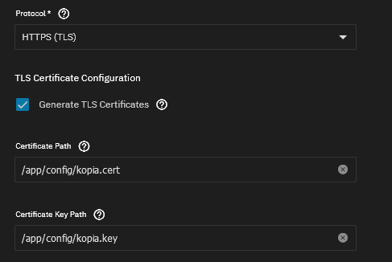
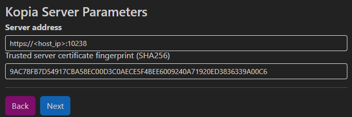

# Running Kopia as a Repository Server

Kopia can run in a standalone mode to back up files from the computer on which
it runs, or as a repository server to act as a repository for multiple computers
to use remotely and share configuration. To be able to be used as a repository
server, Kopia must be running in a secure mode with TLS certificates.

## Instruction Summary

1. When creating the Kopia App, use the preferred settings below
2. Open the Kopia Web UI at `https://<server_ip>:10238/repo` and create a Local
Directory or NAS repository at `/repository`
3. Create a client user from the TrueNAS terminal by doing `sudo k3s kubectl exec -it <kopia_pod_name> -n ix-kopia -- kopia server user add <user>@<host>`
using your pod's name and preferred user and host for the Kopia client. You will
be prompted to create a password for the user which will be stored in the Kopia
repository
4. Get the `SERVER CERT SHA256` fingerprint from the Kopia logs with `sudo k3 kubectl logs -l pod.name=main -n ix-kopia`
5. Configure your Kopia client with the same URL used for the Kopia Web UI and
certificate fingerprint
6. Enter the username and password you created when prompted by the Kopia client

### Preferred Settings

> - Username: kopia
> - Protocol: HTTPS (TLS)
> - Generate TLS Certificates: Checked -> Edit the app and uncheck after first start
> - App Config Storage: Host Path -> Choose a dataset
> - Additional App Storage: Host Path -> Choose a dataset -> Mount path: `/repository`

## Detailed Instructions

### Configure the App

To use TLS certificates with the Kopia App change the "Protocol" option under
"Main Service Configuration" to "HTTPS (TLS)". If you have certificates you wish
to use, leave the "Generate TLS Certificate" option unchecked, and ensure you
configure the host bindings to provide your certificate and private key at the
paths specified. It is also recommended that you set the "User" parameter to
"kopia" because of [this issue](https://github.com/kopia/kopia/issues/880#issuecomment-798421751).

If you would prefer Kopia to generate certificates for you, check "Generate TLS
Certificates" and run the app once. After it is running edit the application
configuration and uncheck "Generate TLS Certificates" to allow the server to
reuse the one it created on the first run. If you have Kopia generate the
certificates you should consider having the Kopia configuration saved to a host
volume instead of a PVC. This will ensure you have access to the certificate in
case you need to re-deploy the application and wish your clients to be able to
connect to the new instance.



*HTTPS Configuration under Main Service Configuration*

#### Storage and Persistance Configuration

When running Kopia as a server you should at a minimum configure the App Config
Storage to be a Host Path volume in case you need to redeploy the application
and lose the persistent volume claim.

Additionally, it may be useful to have a
Host Path volume to use for the actual data which will be stored by Kopia. You
can do this by creating an Additional App Storage configuration, choosing your
local dataset, and choosing a path for it inside the Kopia App. `/repository` is
a good default because it is what Kopia will default to.


*Recommended Additional App Storage options*

### Connecting Clients

Before connecting any clients there are a few steps you need to take with the
Kopia server in order to be able to successfully use it as a repository server.
You will need to get the server's TLS certificate fingerprint, configure a
repository, and add remote users.

#### Create a repository

After the app deploys, navigate to `https://<host_ip>:10238` where `<host_ip>`
is the IP address or DNS name for your TrueNAS Scale host. If you changed the
port Kopia is hosted at, also change `10238` to whatever value you set for the
application port.

If you are presented with a certificate error because your web
browser has identified that the server's certificate is self-signed and you had
Kopia generate the certificates verify that it is the one generated by checking
the Subject Name and Issuer Name. Both should be "Kopia" if the server generated
the certificates. If this is the case, you should be able to tell your browser
to trust the site and continue where you will be prompted for a username and
password.

Use the values you set in the Kopia App configuration. It is
recommended that you use the username "kopia" because of [this issue](https://github.com/kopia/kopia/issues/880#issuecomment-798421751).
Once you sign in, you should see the Kopia dashboard. From there, choose "Local
Directory or NAS" to create a new repository. The UI has a wizard that will walk
you through creating the repository. Follow the steps and use the path you set
for the Additional App Storage as the repository path.

#### Add Users

After creating the repository you can now add users to the system which Kopia
will use to authenticate and authorize clients. This requires that you run a
command in the app's terminal.

Open a console inside the Kopia app by running the following from your TrueNAS
terminal:

```bash
$ sudo k3s kubectl get pods -n ix-kopia # <-- List the running pods to get the one to run inside
NAME                     READY   STATUS    RESTARTS   AGE
kopia-574b454d64-n9mhq   1/1     Running   0          2m6s # <-- Copy the pod name to use in the next command

$ sudo k3s exec -it kopia-574b454d64-n9mhq -n ix-kopia -- /bin/sh # <-- Open a shell in the pod
```

At the terminal inside the app run the following to create new users. You will
be prompted to enter and confirm the password for that user.

```sh
$ kopia server add user <user>@<host> # <-- Replace <user> and <host> with your client username and hostname
Enter new password for user <user>@<host>:
Re-enter new password for verification:
```

***If you are using KopiaUI it is important to ensure you use the username and
hostname from the system you will be using as a client.*** Repeat this for each
user you would like to use with the Kopia server.

#### Get the Certificate Fingerprint

You will need the TLS certificate fingerprint for your server in order to
connect a client. This is printed in the log of the main container for the app
if you had Kopia generate certificates. To get the log run the following command
on your TrueNAS Scale system:

```bash
sudo k3 kubectl logs -l pod.name=main -n ix-kopia
```

It should have an output like:

```text
Server will allow connections from users whose accounts are stored in the repository.
User accounts can be added using 'kopia server user add'.

Repository not configured.
SERVER CERT SHA256: 9ac78fb7d54917cba58ec00d3c0aece5f4bee6009240a71920ed3836339a00c6
writing TLS certificate to /app/config/kopia.cert
writing TLS private key to /app/config/kopia.key
SERVER ADDRESS: https://[::]:10238
Open the address above in a web browser to use the UI.
```

If you don't see `SERVER CERT SHA256` in the log, you can get it directly from
the certificate. This can be done from your TrueNAS host console if you
configured Kopia to have a host volume for its configuration data. If you did
not you can use the instructions from the section above to create a shell inside
the Kopia app.

To get the fingerprint from the certificate, do the following but replace
`/app/config/kopia.cert` with the correct path for your configuration. It should
return a SHA256 fingerprint which you will need to use with Kopia clients and
you can save this somewhere for reference.

#### Get the SHA256 fingerprint from a certificate

```bash
$ openssl x509 -in /app/config/kopia.cert -noout -fingerprint -sha256 | sed 's/://g' | cut -f 2 -d =
9AC78FB7D54917CBA58EC00D3C0AECE5F4BEE6009240A71920ED3836339A00C6
```

### Using the Kopia Client

Once you have created a repository, at least one user, and found the server
fingerprint you can now connect a Kopia client. If you are using KopiaUI, open
the client and choose "Kopia Repository Server".



*Enter the server connection information*

After connecting to the server, enter the password for the user you created in
the earlier step. You should now be able to create and manage snapshots using
the Kopia app as a remote repository!
